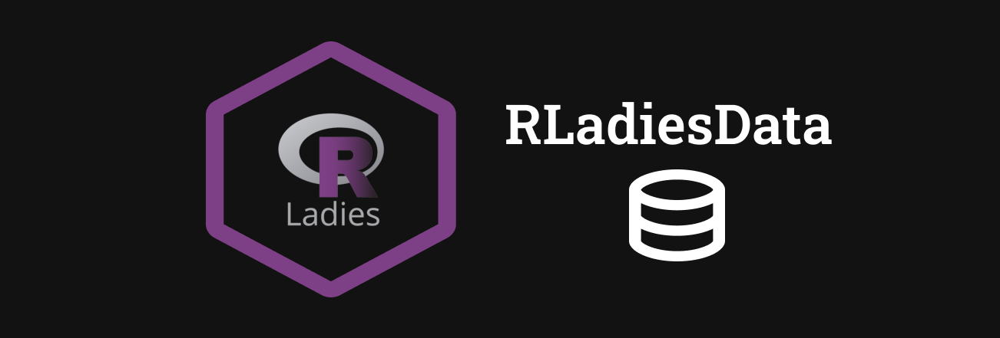

# RLadiesData

RLadies data pkg is a dataset package for RLadies meetups, to have datasets that are specific for RLadies use. The datasets are not all cleaned and tidy for educational learning reasons. 

You can install this package with
`remotes::install_github("PythonCoderUnicorn/RLadiesData")`

